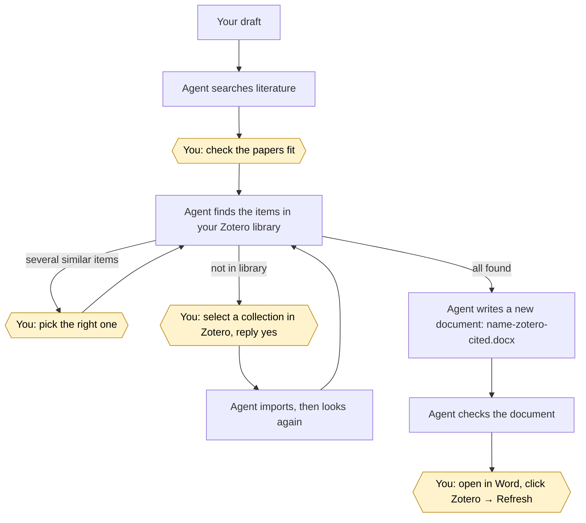

# zotero-word-citation-for-codex-claude

[简体中文](README.md) · **English**

Let **Claude Code** or **OpenAI Codex** add **real Zotero citations** to your Word documents.

Tell the agent "find literature for this draft and add citations", and it will:

1. search PubMed, OpenAlex and Crossref for papers that support your text;
2. find the matching items in the Zotero library on your computer, and import missing ones **only after you agree**;
3. produce a new Word document whose citations are **exactly like** the ones you insert by hand with the Zotero add-in: you can refresh them, switch citation styles and keep editing. They are not frozen `[1]` text.

Your original document is never changed. The agent never installs software for you and never changes Zotero behind your back.

> [!WARNING]
> **Microsoft Word only. WPS is not supported.** If the generated document is opened and saved in WPS, the citations turn into plain text and can no longer be refreshed. LibreOffice and Pages are not supported either.

## Contents

- [Before you start](#before-you-start)
- [Installation](#installation)
- [How to use it](#how-to-use-it)
- [FAQ](#faq)
- [Safety guarantees](#safety-guarantees)
- [Citation styles](#citation-styles)
- [Advanced](#advanced)
- [Acknowledgements](#acknowledgements)
- [License](#license)

## Before you start

### What you need

| Software | Notes |
|---|---|
| Claude Code or OpenAI Codex | runs the skill |
| Python 3.9 or newer | if you don't have it, the agent walks you through installing it |
| Zotero Desktop 7 or newer | must **stay open** while you work |
| Microsoft Word (2016 or Microsoft 365) + Zotero Word add-in | opens and refreshes the generated document |
| Internet | only for literature search |

Works on Windows, macOS and Linux. The only difference: the optional Word PDF preview is Windows-only.

### One-time setup

1. **Install Python (skip if you already have it).**
   If the agent finds no Python, it points you to [python.org/downloads](https://www.python.org/downloads/).
   On Windows, **tick "Add python.exe to PATH"** in the installer. Afterwards, close and reopen the agent.

2. **Turn on Zotero's local communication switch (required, cannot be skipped).**
   The skill talks to Zotero through this switch.
   - Open Zotero → Settings (Windows: Edit → Settings; macOS: Zotero → Settings…) → Advanced → Miscellaneous;
   - tick **"Allow other applications on this computer to communicate with Zotero"**;
   - **send a screenshot to the agent**. It confirms and then checks the connection itself.

3. **Sign in to Zotero (most people already are; usually skip).**
   The agent checks automatically. Only if you are not signed in will it ask you to sign in under Zotero → Settings → Sync (free zotero.org account) and sync once. The agent never asks for your password.

4. **Install the Zotero Word add-in.**
   Zotero → Settings → Cite → Word Processors → Install Microsoft Word Add-in, then **restart Word**.
   Word now shows a "Zotero" tab.

Citation styles (APA, Vancouver, …) need no preparation. You can change them in Word anytime.

Menu paths for every step, in English and Chinese UI: [manual steps checklist](docs/en/manual-steps.md).

## Installation

### Step 1: get the code

```bash
git clone https://github.com/milletvhyidavis/zotero-word-citation-for-codex-claude.git
```

```bash
cd zotero-word-citation-for-codex-claude
```

### Step 2: install into your agent

Pick the command for the tool you use.

Claude Code:

```bash
python install.py --target claude
```

OpenAI Codex:

```bash
python install.py --target codex
```

Use `--target both` for both. On Windows, if `python` is not found, replace it with `py -3`.

The skill is installed as `zotero-word-live-citations` under `~/.claude/skills/` or `~/.codex/skills/`.

Alternatively, inside Claude Code, install from the plugin marketplace:

```text
/plugin marketplace add milletvhyidavis/zotero-word-citation-for-codex-claude
```

```text
/plugin install zotero-word-live-citations@zotero-word-live-citations
```

More options (project-only install, dry run, uninstall): [installation guide](docs/en/installation.md).

### Step 3: check that it works

Open Zotero, start a **new** agent session and say: "run the zotero-word-live-citations self-test".

Or run it yourself (Codex users: replace `.claude` with `.codex`):

```bash
python ~/.claude/skills/zotero-word-live-citations/scripts/selftest.py
```

When everything is ready, the output looks like this:

```text
[OK ] python: 3.12.4 at …
[OK ] zotero-running: Zotero 10.0.2
[OK ] zotero-local-api: local API enabled
[OK ] zotero-read-items: read one item key
[OK ] zotero-logged-in: signed in (user library 1234567)
[OK ] docx-pipeline: insert + validate OK
[OK ] microsoft-word: C:\Program Files\Microsoft Office\root\Office16\WINWORD.EXE
```

If a line shows `[NO ]`, send the whole output to the agent and it will tell you what to do.

## How to use it

### Just ask the agent

- *"Write a short review on cancer immunotherapy, find literature for every claim, and give me a Word file with Zotero citations in Vancouver style."*
- *"Find supporting literature for each claim in `draft.md` and give me a Word file with Zotero citations in APA style."*
- *"Insert the references from `refs.ris` into `manuscript.docx` at the marked places."*
- *"Insert citations for these DOIs into `chapter3.docx` after the sentences I list. Don't change any text."*
- *"Check whether the Zotero citations in `thesis.docx` are valid."*

In Codex you can also invoke the skill directly as `$zotero-word-live-citations`.

### What you need to do along the way

The agent does most of the work, but a few things are always up to you:

| When | What you do |
|---|---|
| The agent lists "claim → paper" | Check that each paper really supports your claim. The agent only cites papers a search actually returned, but whether they support you is your call |
| The agent finds several similar items in Zotero | Tell it which one to use |
| The agent wants to import new papers into Zotero | First **click (or create) the target folder** in the Zotero window's left pane (Zotero calls it a "collection"), then reply "**yes**". New items go into whatever collection is selected |
| You receive the new document | Open it in Word and click **Zotero tab → Refresh** |

About imports:
- The agent first tells you "N records → collection X" and imports only after you say yes. If you change the selected collection in the meantime, the import is cancelled automatically.
- Every imported item carries the tag `zwlc-import`. To undo, find them by that tag in Zotero and delete them yourself (the skill never deletes anything).



Yellow hexagons are your steps; everything else is automatic.

### After you get the document

1. Open `name-zotero-cited.docx` in **Microsoft Word**. If WPS opens `.docx` files by default, use right-click → Open with → Word.
2. Click **Zotero tab → Refresh**. Before Refresh the citation text is only a placeholder; Refresh formats it properly.
3. Check the numbering and the bibliography at the end.
4. To change the citation style, click **Zotero → Document Preferences**.

The agent never clicks Refresh for you. For shared documents, talk to your co-authors first.

## FAQ

**Is my original document changed?**
No. All changes go into a new file, and the agent verifies the original is unchanged.

**Will it delete or edit my Zotero items?**
No. The only thing it ever writes is importing new items, and only with your approval.

**Why do citations look plain before Refresh?**
That is placeholder text. Zotero formats it in your chosen style when you click Refresh.

**Can the agent click Refresh for me?**
No. You always do that in Word.

**I use a group library.**
Supported. Tell the agent which group (the option is `--library group:<id>`).

**What does "cannot verify library namespace" mean?**
Usually that Zotero is not signed in. Sign in and sync once as the agent explains.

More: [FAQ](docs/en/faq.md) and [troubleshooting](docs/en/troubleshooting.md).

## Safety guarantees

- **Your original is never overwritten.** Output always goes to a new `name-zotero-cited.docx`; the report lists checksums of both files.
- **No Zotero changes without approval.** The only write is an import, and you must approve the exact count and destination. Items are never edited, moved, merged or deleted, and Zotero settings are never changed.
- **No invented references.** Only papers a search tool actually returned; DOIs are never made up.
- **No guessing.** Uncertain matches go to you; failed imports are reported honestly.
- **No fake formatting.** Final citation text is produced by Zotero when you Refresh.
- **Minimal edits.** Everything unrelated to citations is kept as is, and existing citations are checked to survive.
- **Local only.** Zotero is reached on your own computer. No account password is needed and there is no telemetry. The internet is used only for literature search. See [SECURITY.md](SECURITY.md).

## Citation styles

Choose a style when generating the document, or change it in Word anytime. Common styles have short names:

| Short name | Style |
|---|---|
| `vancouver` (default) | Vancouver |
| `apa` | APA |
| `nature` | Nature |
| `ieee` | IEEE |
| `ama` | AMA (American Medical Association) |
| `chicago-author-date` | Chicago author-date |
| `harvard` | Harvard (Cite Them Right) |
| `gb-t-7714-numeric` | GB/T 7714-2015 numeric (Chinese national standard) |
| `gb-t-7714-author-date` | GB/T 7714-2015 author-date |

Any other style works too: give the agent its full address from the Zotero style repository, e.g. `http://www.zotero.org/styles/cell`. The style must be installed in your Zotero for Refresh to use it. Use `--locale` for the citation language (default `en-US`).

## Advanced

### Technical details

- It writes the same Word fields the official Zotero add-in uses: one `ADDIN ZOTERO_ITEM CSL_CITATION` field per citation, one `ZOTERO_BIBL` bibliography field, and `ZOTERO_PREF_n` document preferences for style and language.
- Matching order: pinned Zotero key > DOI > PMID > exact title > title + first author + year.
- One citation can hold several papers (`[@ref:A; @ref:B]` becomes one field).
- Each citation embeds the item data (`itemData`), so it still refreshes for co-authors who don't have the item.
- When the text must not change at all, `placements.json` places citations by quoting the original text.
- Python standard library only; no third-party packages.

### Verified end-to-end

Environment: Windows 11 + Zotero 10.0.2 + Word 16 (Microsoft 365) + Zotero Word add-in.

A ~1,575-character Chinese review on tumour immunology with 18 citation markers went through the whole process:

- 15 searches, 18 papers chosen;
- none of the 18 were in the library; after the user selected a collection and approved, all were imported;
- on the second match, 18/18 were found by DOI;
- 17 citations (one cites two papers) plus a bibliography were written in GB/T 7714-2015 numeric style;
- automatic checks passed, and **the user's Zotero Refresh in Word succeeded**.

Step by step: [worked example in the usage guide](docs/en/usage.md#16-worked-example-a-chinese-tumour-immunology-review).

### Repository layout

```text
zotero-word-citation-for-codex-claude/
├── skills/zotero-word-live-citations/   # the skill itself
│   ├── SKILL.md                 # workflow for the agent
│   ├── agents/openai.yaml       # Codex UI metadata
│   ├── references/              # reference docs for the agent
│   ├── scripts/                 # all scripts
│   │   ├── selftest.py             # environment check
│   │   ├── search_literature.py    # literature search
│   │   ├── resolve_references.py   # match against your Zotero library
│   │   ├── build_import_file.py    # import file for missing papers
│   │   ├── zotero_local.py         # read Zotero, import with approval
│   │   ├── md_to_docx.py           # Markdown → Word
│   │   ├── insert_zotero_fields.py # write Zotero citations
│   │   ├── validate_zotero_docx.py # check the document
│   │   ├── word_render.py          # Word PDF preview (Windows)
│   │   └── _common.py              # shared helpers
│   └── tests/                   # unit tests
├── docs/zh-CN/ · docs/en/       # detailed docs in Chinese and English
├── .claude-plugin/ · .codex-plugin/   # plugin manifests
├── install.py                   # installer
├── README.md · README.en.md
├── CHANGELOG.md · CONTRIBUTING.md · SECURITY.md
└── LICENSE · NOTICE
```

### Documentation

| Topic | English | 中文 |
|---|---|---|
| **Manual steps checklist** | [manual-steps.md](docs/en/manual-steps.md) | [manual-steps.md](docs/zh-CN/manual-steps.md) |
| Installation | [installation.md](docs/en/installation.md) | [installation.md](docs/zh-CN/installation.md) |
| Usage (every script, option, worked example) | [usage.md](docs/en/usage.md) | [usage.md](docs/zh-CN/usage.md) |
| Troubleshooting | [troubleshooting.md](docs/en/troubleshooting.md) | [troubleshooting.md](docs/zh-CN/troubleshooting.md) |
| FAQ | [faq.md](docs/en/faq.md) | [faq.md](docs/zh-CN/faq.md) |
| Publishing (maintainers) | [publishing.md](docs/en/publishing.md) | [publishing.md](docs/zh-CN/publishing.md) |
| Agent workflow | [SKILL.md](skills/zotero-word-live-citations/SKILL.md) · [references/](skills/zotero-word-live-citations/references/) | |
| Changes · Contributing · Security | [CHANGELOG.md](CHANGELOG.md) · [CONTRIBUTING.md](CONTRIBUTING.md) · [SECURITY.md](SECURITY.md) | same files (bilingual) |

## Acknowledgements

- **[drguptavivek/zotero-use](https://github.com/drguptavivek/zotero-use)** (by [Vivek Gupta](https://github.com/drguptavivek), MIT License): the DOCX validator (`validate_zotero_docx.py`) and part of its tests are adapted from this project, and the Zotero field-safety rules follow it.
- **The Zotero plugin in [openai/plugins](https://github.com/openai/plugins)** (OpenAI, MIT License): the HTTP helpers for the Zotero local API and the connector import flow are adapted from it (settings-changing and Zotero-restart features removed).
- **[Claude Code](https://claude.com/claude-code) by [Anthropic](https://www.anthropic.com)**: this project was developed with the help of Claude Code, which is where the `Co-Authored-By: Claude` lines in the commit history come from.

[NOTICE](NOTICE) lists exactly which files were adapted and keeps the original copyright notices.

## License

Released under the [MIT License](LICENSE).

Zotero is a trademark of the Corporation for Digital Scholarship. This project is not affiliated with or endorsed by Zotero, Microsoft, Anthropic or OpenAI.
