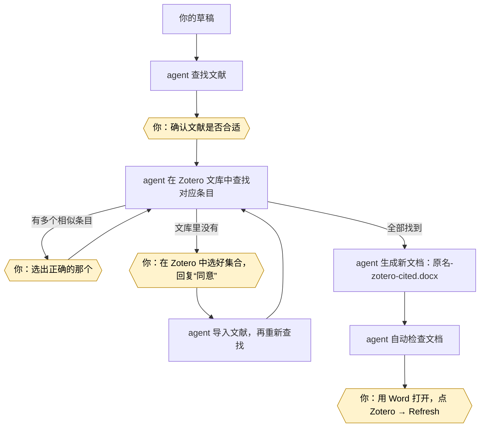

# zotero-word-citation-for-codex-claude

**简体中文** · [English](README.en.md)

让 **Claude Code** 或 **OpenAI Codex** 帮你给 Word 文档加上**真正的 Zotero 引用**。

**不需要compute use！**

你只需要对 agent 说一句“给这篇稿子找文献并加上引用”，它会：

1. 在 PubMed、OpenAlex、Crossref 中查找能支撑你论述的文献；
2. 在你电脑上的 Zotero 文库里找到对应条目；文库里没有的，**经你同意后**才导入；
3. 生成一份新的 Word 文档。里面的引用和你用 Zotero 插件手动插入的**完全一样**：可以一键刷新、切换引文格式、继续编辑，而不是随意修改的 `[1]`。


> [!注意]
> **只支持 Microsoft Word，不支持 WPS。** 生成的文档一旦用 WPS 打开并保存，引用就会变成普通文字，再也无法刷新。LibreOffice、Pages 同样不支持。

## 目录

- [准备工作](#准备工作)
- [安装](#安装)
- [使用方法](#使用方法)
- [常见问题](#常见问题)
- [安全保证](#安全保证)
- [支持的引文格式](#支持的引文格式)
- [进阶内容](#进阶内容)
- [致谢](#致谢)
- [许可](#许可)

## 准备工作

### 需要的软件

| 软件 | 说明 |
|---|---|
| Claude Code 或 OpenAI Codex | 用来运行本技能 |
| Python 3.9 或更高版本 | 没装也没关系，agent 会一步步教你装 |
| Zotero 桌面版 7 或更高版本 | 使用过程中需要**一直开着** |
| Microsoft Word（2016 或 Microsoft 365）+ Zotero Word 插件 | 用来打开、刷新生成的文档 |


Windows、macOS 都能用。

### 首次使用要做的设置（只需一次）

1. **安装 Python（已安装可跳过）。**
   agent 发现电脑上没有 Python 时，会引导你到 [python.org/downloads](https://www.python.org/downloads/) 下载安装包。
   Windows 安装时**一定要勾选 “Add python.exe to PATH”**。装好后关掉并重新打开 agent。

2. **打开 Zotero 的“本地通讯”开关（必需，不能跳过）。**
   本技能通过这个开关和 Zotero 对话。
   - 打开 Zotero → 设置（Windows：编辑 → 设置；macOS：Zotero → 设置…）→ 高级 → 杂项；
   - 勾选 **“允许此计算机上的其他应用程序与 Zotero 通讯”**；
   - **截图发给 agent**，它确认后会再自动检查一遍。

3. **登录 Zotero 账号（大多数人已经登录，可以跳过）。**
   agent 会自动检查。只有发现你没登录时，才会请你在 Zotero → 设置 → 同步 中登录（zotero.org 账号可免费注册）并同步一次。agent 不会向你要密码。

4. **安装 Zotero 的 Word 插件。**
   Zotero → 设置 → 引用 → 文字处理软件 → 安装 Microsoft Word 加载项，然后**重启 Word**。
   装好后，Word 顶部会多出一个 “Zotero” 选项卡。

引文格式（APA、GB/T 7714 等）不需要提前准备，拿到文档后在 Word 里随时可以换。

每一步在中英文界面中的菜单位置，见 [手动步骤清单](docs/zh-CN/manual-steps.md)。

## 安装

### 第 1 步：下载代码

```bash
git clone https://github.com/milletvhyidavis/zotero-word-citation-for-codex-claude.git
```

```bash
cd zotero-word-citation-for-codex-claude
```

### 第 2 步：安装到 agent

按你用的工具选一条命令即可。

Claude Code：

```bash
python install.py --target claude
```

OpenAI Codex：

```bash
python install.py --target codex
```

两个都用就写 `--target both`。Windows 上如果提示找不到 `python`，把命令开头的 `python` 换成 `py -3`。

技能会被安装为 `zotero-word-live-citations`，位置是 `~/.claude/skills/` 或 `~/.codex/skills/`。

也可以在 Claude Code 里用插件市场安装，依次输入：

```text
/plugin marketplace add milletvhyidavis/zotero-word-citation-for-codex-claude
```

```text
/plugin install zotero-word-live-citations@zotero-word-live-citations
```

更多安装选项（只装到某个项目、预览、卸载等）见 [安装说明](docs/zh-CN/installation.md)。

### 第 3 步：检查是否装好

先打开 Zotero，再**新开**一个 agent 会话，对它说：“运行 zotero-word-live-citations 的自检”。

也可以自己运行（Codex 用户把 `.claude` 换成 `.codex`）：

```bash
python ~/.claude/skills/zotero-word-live-citations/scripts/selftest.py
```

一切正常时，输出类似这样：

```text
[OK ] python: 3.12.4 at …
[OK ] zotero-running: Zotero 10.0.2
[OK ] zotero-local-api: local API enabled
[OK ] zotero-read-items: read one item key
[OK ] zotero-logged-in: signed in (user library 1234567)
[OK ] docx-pipeline: insert + validate OK
[OK ] microsoft-word: C:\Program Files\Microsoft Office\root\Office16\WINWORD.EXE
```

如果某一行是 `[NO ]`，把整段输出发给 agent，它会告诉你怎么处理。

## 使用方法

### 直接对 agent 说

- “用中文写一篇肿瘤免疫治疗的短综述，为每个论断查找文献，最后给我一份带 Zotero 引用、GB/T 7714 顺序编码制的 Word 文档。”
- “为 `draft.md` 里的每个论断找文献，生成带 Zotero 引用的 Word，格式用 Vancouver。”
- “把 `refs.ris` 里的文献插入 `manuscript.docx` 中标记的位置。”
- “在 `chapter3.docx` 里我列出的这几句话后面插入这些 DOI 的引用，正文一个字都不要改。”
- “检查 `thesis.docx` 里的 Zotero 引用是否有效。”

在 Codex 中，也可以用 `$zotero-word-live-citations` 直接调用本技能。

### 过程中需要你做的事

大部分工作由 agent 自动完成，但以下几件事必须由你来做：

| 什么时候 | 你要做什么 |
|---|---|
| agent 列出“论述 → 文献”清单时 | 检查每篇文献是否真的支持你的观点。agent 只会引用真实检索到的文献，但“支不支持”要由你判断 |
| agent 说某篇文献在 Zotero 里有好几个相似条目时 | 告诉它该用哪一个 |
| agent 要把新文献导入 Zotero 时 | 先在 Zotero 窗口左侧**点选（或新建）要放入的文件夹**（Zotero 里叫“集合”），再回复“**同意**”。新文献会进入你当前选中的集合 |
| 拿到新文档后 | 用 Word 打开，点击 **Zotero 选项卡 → Refresh（刷新）** |

关于导入：
- agent 会先告诉你“共 N 条 → 放入集合 X”，你回复“同意”后才会导入；如果这期间你换了选中的集合，导入会自动取消。
- 导入的文献都带有 `zwlc-import` 标签。想撤销的话，在 Zotero 里按这个标签找到它们，自己删除即可（本技能从不删除任何东西）。



黄色六边形是需要你亲自操作的步骤，其余由 agent 自动完成。

### 拿到文档之后

1. 用 **Microsoft Word** 打开 `原名-zotero-cited.docx`。如果电脑默认用 WPS 打开，请右键 → 打开方式 → Word。
2. 点击 **Zotero 选项卡 → Refresh（刷新）**。刷新前看到的引用文字只是临时占位，刷新后才会变成正式格式。
3. 检查引用编号和文末参考文献表。
4. 想换引文格式，点击 **Zotero → Document Preferences（文档首选项）**。

agent 永远不会替你点 Refresh。多人共享的文档，处理前请先和合作者沟通。

## 常见问题

**原稿会被修改吗？**
不会。所有改动都写在一份新文件里，agent 还会核对原稿确实没变。

**会删除或修改我 Zotero 里的文献吗？**
不会。它唯一会做的写操作是导入新文献，而且必须你同意。

**为什么刷新前引用看起来很简陋？**
这是临时文字，点 Refresh 后 Zotero 会按你选的格式重新排版。

**agent 能替我点 Refresh 吗？**
不能，这一步永远由你在 Word 里完成。

**用的是群组文库怎么办？**
支持。告诉 agent 用哪个群组即可（对应参数 `--library group:<id>`）。

**提示 “cannot verify library namespace” 是什么意思？**
通常是 Zotero 没有登录。按 agent 的提示登录并同步一次即可。

更多问题见 [常见问题](docs/zh-CN/faq.md) 和 [故障排查](docs/zh-CN/troubleshooting.md)。

## 安全保证

- **不覆盖原稿。** 结果总是写到新文件 `原名-zotero-cited.docx`，报告里会列出前后两个文件的校验值。
- **不擅自改动 Zotero。** 唯一的写操作是导入，且必须你明确同意具体条数和位置。不会编辑、移动、合并或删除条目，也不会改 Zotero 设置。
- **不编造文献。** 只引用检索工具真实返回的论文，不会凭空写 DOI。
- **不猜测。** 拿不准的匹配交给你决定；导入失败会如实告诉你。
- **不伪造排版。** 引用的最终格式由 Zotero 在你刷新时生成。
- **只改必要的部分。** 文档中与引用无关的内容原样保留，已有的引用也会被检查是否完好。
- **只在本机访问 Zotero。** 不需要任何账号密码，没有数据上报。只有查找文献时会联网。详见 [SECURITY.md](SECURITY.md)。

## 支持的引文格式

生成文档时可以指定格式，之后也可以在 Word 里随时更换。常用格式可以直接用简称：

| 简称 | 格式 |
|---|---|
| `vancouver`（默认） | Vancouver |
| `apa` | APA |
| `nature` | Nature |
| `ieee` | IEEE |
| `ama` | AMA（美国医学会） |
| `chicago-author-date` | Chicago 作者–年份 |
| `harvard` | Harvard（Cite Them Right） |
| `gb-t-7714-numeric` | GB/T 7714-2015 顺序编码制 |
| `gb-t-7714-author-date` | GB/T 7714-2015 著者–出版年制 |

其他格式也可以用，只要把 Zotero 样式库中的完整地址告诉 agent，例如 `http://www.zotero.org/styles/cell`。刷新时要用到的格式需要已安装在你的 Zotero 中。中文引文可加 `--locale zh-CN`。

## 进阶内容

### 技术细节

- 写入的是 Zotero 官方插件使用的同一种 Word 域：每处引用一个 `ADDIN ZOTERO_ITEM CSL_CITATION` 域，文末一个 `ZOTERO_BIBL` 参考文献表域，再加上记录格式和语言的 `ZOTERO_PREF_n` 文档设置。
- 匹配顺序：指定的 Zotero key > DOI > PMID > 题名完全一致 > 题名 + 第一作者 + 年份。
- 一处引用可以包含多篇文献（`[@ref:A; @ref:B]` 合成一个域）。
- 每条引用都内嵌文献信息（`itemData`），合作者的文库里即使没有这篇文献也能正常刷新。
- 正文一个字都不能改时，可以用 `placements.json` 按原文定位插入位置。
- 只使用 Python 标准库，不需要安装任何第三方包。

### 端到端实测

测试环境：Windows 11 + Zotero 10.0.2 + Word 16（Microsoft 365）+ Zotero Word 插件。

用一篇约 1,575 字的中文肿瘤免疫学综述（18 处引用标记）完整跑了一遍：

- 检索 15 次，选定 18 篇论文；
- 这 18 篇原本都不在文库中，用户选好集合并同意后全部导入；
- 重新匹配后 18/18 全部按 DOI 找到；
- 写入 17 处引用（其中一处同时引用两篇）和参考文献表，格式为 GB/T 7714-2015 顺序编码制；
- 自动检查通过，**用户在 Word 中点击 Refresh 成功**。

详细过程见 [使用说明中的完整实例](docs/zh-CN/usage.md#worked-example)。

### 仓库结构

```text
zotero-word-citation-for-codex-claude/
├── skills/zotero-word-live-citations/   # 技能本体
│   ├── SKILL.md                 # 写给 agent 的工作流程
│   ├── agents/openai.yaml       # Codex 界面信息
│   ├── references/              # agent 参考文档
│   ├── scripts/                 # 全部脚本
│   │   ├── selftest.py             # 环境自检
│   │   ├── search_literature.py    # 查找文献
│   │   ├── resolve_references.py   # 与 Zotero 文库匹配
│   │   ├── build_import_file.py    # 为缺失文献生成导入文件
│   │   ├── zotero_local.py         # 读取 Zotero、经同意后导入
│   │   ├── md_to_docx.py           # Markdown 转 Word
│   │   ├── insert_zotero_fields.py # 写入 Zotero 引用
│   │   ├── validate_zotero_docx.py # 检查文档
│   │   ├── word_render.py          # 用 Word 生成 PDF 预览（Windows）
│   │   └── _common.py              # 公共工具
│   └── tests/                   # 单元测试
├── docs/zh-CN/ · docs/en/       # 中英文详细文档
├── .claude-plugin/ · .codex-plugin/   # 插件清单
├── install.py                   # 安装脚本
├── README.md · README.en.md
├── CHANGELOG.md · CONTRIBUTING.md · SECURITY.md
└── LICENSE · NOTICE
```

### 文档索引

| 主题 | 中文 | English |
|---|---|---|
| **手动步骤清单** | [manual-steps.md](docs/zh-CN/manual-steps.md) | [manual-steps.md](docs/en/manual-steps.md) |
| 安装 | [installation.md](docs/zh-CN/installation.md) | [installation.md](docs/en/installation.md) |
| 使用（全部脚本、参数、完整实例） | [usage.md](docs/zh-CN/usage.md) | [usage.md](docs/en/usage.md) |
| 故障排查 | [troubleshooting.md](docs/zh-CN/troubleshooting.md) | [troubleshooting.md](docs/en/troubleshooting.md) |
| 常见问题 | [faq.md](docs/zh-CN/faq.md) | [faq.md](docs/en/faq.md) |
| 发布指南（维护者） | [publishing.md](docs/zh-CN/publishing.md) | [publishing.md](docs/en/publishing.md) |
| agent 工作流程（英文） | [SKILL.md](skills/zotero-word-live-citations/SKILL.md) · [references/](skills/zotero-word-live-citations/references/) | |
| 更新日志 · 贡献 · 安全 | [CHANGELOG.md](CHANGELOG.md) · [CONTRIBUTING.md](CONTRIBUTING.md) · [SECURITY.md](SECURITY.md) | 同左（中英双语） |

## 致谢

- **[drguptavivek/zotero-use](https://github.com/drguptavivek/zotero-use)**（作者 [Vivek Gupta](https://github.com/drguptavivek)，MIT 许可）：本项目的 DOCX 验证器（`validate_zotero_docx.py`）及其部分测试改编自该项目，Zotero 域的安全规则也参考了它。
- **[openai/plugins](https://github.com/openai/plugins) 中的 Zotero 插件**（OpenAI，MIT 许可）：本项目访问 Zotero 本地 API 的 HTTP 工具函数和 connector 导入流程改编自该插件（已移除修改设置、重启 Zotero 等功能）。
- **[Anthropic](https://www.anthropic.com) 的 [Claude Code](https://claude.com/claude-code)**：本项目在 Claude Code 的协助下开发，提交记录中的 `Co-Authored-By: Claude` 即来源于此。

具体改编了哪些文件，以及原项目的版权声明，见 [NOTICE](NOTICE)。

## 许可

本项目采用 [MIT 许可](LICENSE)。

Zotero 是 Corporation for Digital Scholarship 的商标。本项目与 Zotero、Microsoft、Anthropic、OpenAI 均无隶属或背书关系。
