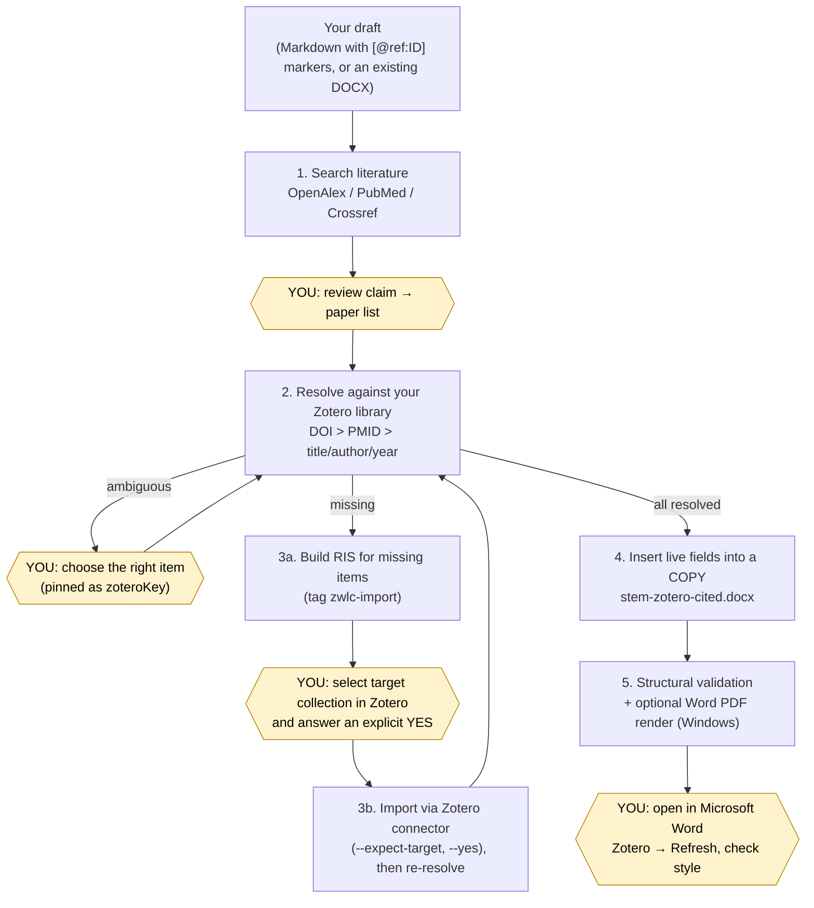

# zotero-word-live-citations

**English** · [简体中文](README.zh-CN.md)

An agent skill for **Claude Code** and **OpenAI Codex** that turns a draft into a Word document with **live Zotero citations**. It finds supporting papers (OpenAlex, PubMed, Crossref) and matches them to your local Zotero Desktop library. Missing items are imported only after you explicitly approve. It then writes real `ADDIN ZOTERO_ITEM CSL_CITATION` and `ZOTERO_BIBL` fields into a **copy** of your DOCX. You get a document the Zotero Word add-in can refresh, restyle and edit like citations you inserted by hand, not plain `[1]` text. Python ≥ 3.9 standard library only. Nothing is installed automatically.

> [!IMPORTANT]
> **Some steps can only be done by you.** The agent automates searching, matching, file building, field insertion and validation. It does **not** install software, it **never imports into Zotero without your explicit "yes"**, and it **never runs Zotero Refresh**. Read [Manual steps you must do](#manual-steps-you-must-do) before your first run.

## Contents

- [How it works](#how-it-works)
- [Features](#features)
- [Requirements](#requirements)
- [Manual steps you must do](#manual-steps-you-must-do)
- [Quick start](#quick-start)
- [Example prompts](#example-prompts)
- [Minimal manual CLI run](#minimal-manual-cli-run)
- [Supported citation styles](#supported-citation-styles)
- [Safety guarantees](#safety-guarantees)
- [Verified end-to-end](#verified-end-to-end)
- [Repository layout](#repository-layout)
- [Documentation](#documentation)
- [FAQ](#faq)
- [License and credits](#license-and-credits)

## How it works



Rectangles are automatic. **Yellow hexagons are human actions.**

## Features

- **End-to-end chain:** literature search → Zotero item (key + URI + CSL `itemData`) → DOCX Zotero field → your Refresh in Word.
- **Real Zotero fields:** `ADDIN ZOTERO_ITEM CSL_CITATION` per citation location, one `ZOTERO_BIBL` bibliography field, and `ZOTERO_PREF_n` document preferences (style, locale).
- **Careful matching:** pinned key > DOI > PMID > exact title > title + first author + year. Ambiguous matches are **never** auto-picked, and duplicates are reported, never merged.
- **Approval-gated imports:** RIS/BibTeX built for review, imported into the collection *you* selected, with `--expect-target` protection and a `zwlc-import` tag for easy undo.
- **Two insertion modes:** `[@ref:ID]` / `[@zotero:KEY]` / `[@doi:…]` markers, or `placements.json` anchors when the text must not change (with `--list-paragraphs` and `--dry-run`).
- **Multiple items per citation** (`[@ref:A; @ref:B]` → one field), embedded `itemData` so citations work for co-authors without the item, and existing citations preserved and verified.
- **Validation you can trust:** ZIP/XML integrity, complete fields, unique `citationID`s, key ↔ URI consistency, `itemData` coverage, baseline preservation. Optional Word COM rendering to PDF on Windows.
- **Markdown → DOCX** converter for agent-written manuscripts (CJK font support).
- **Chinese-friendly:** GB/T 7714-2015 aliases, `zh-CN` locale, Chinese paths and UTF-8 console output on Windows.
- **Stdlib only, nothing auto-installed.** 38 unit tests.

## Requirements

| Component | Version | Needed for |
|---|---|---|
| Python | ≥ 3.9 | everything |
| Zotero Desktop | 7+ (verified 10.0.2), **running**, with *Allow other applications on this computer to communicate with Zotero* enabled (local API `http://127.0.0.1:23119/api/`) | matching, importing |
| Microsoft Word + Zotero Word add-in | Word 2016 / Microsoft 365 (verified Word 16) | Refresh (manual); PDF rendering (Windows only) |
| Claude Code or OpenAI Codex | current | running it as an agent skill |
| Internet | | literature search only |

## Manual steps you must do

> [!IMPORTANT]
> **Before first use (once)**
> 1. **Install Python ≥ 3.9.** If the computer has no Python yet, the agent walks you through it: download the installer from [python.org/downloads](https://www.python.org/downloads/); on Windows **tick "Add python.exe to PATH"**. Then reopen the terminal / agent session and confirm with `python --version` or `py -3 --version`. The skill itself never installs software.
> 2. **Start Zotero and enable local communication (required).** The skill works through the Zotero local API, so this step cannot be skipped. Zotero → Settings (Windows: Edit → Settings; macOS: Zotero → Settings…) → Advanced → Miscellaneous → tick **"Allow other applications on this computer to communicate with Zotero"**, then **send the agent a screenshot of the ticked setting**. The agent checks it and confirms with `zotero_local.py status`.
> 3. **Sign in to Zotero (usually already done, optional).** Most users are already signed in and need to do nothing. The agent checks automatically; only if it detects that you are not signed in will it ask you to sign in under Zotero → Settings → Sync (free zotero.org account), sync once, and send a screenshot of the Sync page. Without sign-in, Zotero exposes no user ID and citations fail to resolve. The agent never asks for your password.
> 4. **Install the Zotero Word add-in:** Zotero → Settings → Cite → Word Processors → Install Microsoft Word Add-in, then **restart Word**.
>
> No citation style needs to be prepared in advance: change it anytime afterwards in Word → Zotero → Document Preferences.

> [!WARNING]
> **WPS is not supported.** Open, refresh and save the output only in **Microsoft Word** with the Zotero add-in. Saving in WPS turns the Zotero fields into plain text. If WPS is the default app for `.docx`, use right-click → Open with → Word. LibreOffice and Pages are not supported either.

> [!CAUTION]
> **Before every import:** in the **Zotero window, create or select the target collection yourself.** The connector imports into whatever collection is selected. There is no collection parameter. The agent tells you *"N records → collection X"* and waits for an explicit **yes**. `--expect-target` refuses if the selection changed. Use a dedicated test collection. Imports carry the tag `zwlc-import` so you can find and undo them yourself (the skill never deletes).

> [!WARNING]
> **Review the literature.** The agent may only cite papers a tool actually returned. It never invents DOIs. **Whether each paper really supports your claim is your responsibility.** Resolve ambiguous matches when asked (the agent pins your choice with `"zoteroKey"`).

> [!IMPORTANT]
> **After generation:** open `<stem>-zotero-cited.docx` in **Microsoft Word** (not WPS, LibreOffice or Pages, which can destroy the fields) → **Zotero tab → Refresh** → check style, numbering and bibliography. The text before Refresh is **provisional**. Change the style anytime via **Zotero → Document Preferences**. Refresh is **never** run automatically.

> [!NOTE]
> Keep backups, never let anything overwrite your original, and coordinate before touching shared documents. PDF rendering (`word_render.py`) is Windows-only; skip it on macOS/Linux. Optional: `ZWLC_MAILTO`, `NCBI_API_KEY`, `ZOTERO_LOCAL_BASE_URL`.

**Full checklist with menu paths (English and Chinese UI): [docs/en/manual-steps.md](docs/en/manual-steps.md)**

## Quick start

### 1. Get the code

```bash
git clone https://github.com/milletvhyidavis/zotero-word-live-citations.git
```

```bash
cd zotero-word-live-citations
```

### 2a. Claude Code

With the installer (copies the skill to `~/.claude/skills/zotero-word-live-citations`):

```bash
python install.py --target claude
```

Or via the plugin marketplace, inside Claude Code:

```text
/plugin marketplace add milletvhyidavis/zotero-word-live-citations
```

```text
/plugin install zotero-word-live-citations@zotero-word-live-citations
```

### 2b. OpenAI Codex

Copies the skill to `$CODEX_HOME/skills/` (default `~/.codex/skills/`):

```bash
python install.py --target codex
```

### 2c. Manual copy

Copy `skills/zotero-word-live-citations/` to `~/.claude/skills/` or `~/.codex/skills/` so that `SKILL.md` sits directly inside `zotero-word-live-citations/`.

Other installer options: `--target both`, `--project <dir>` (project-local install), `--dry-run`, `--force` (replace a differing install), `--uninstall`. On Windows, use `py -3 install.py …` if `python` is not available. Details: [docs/en/installation.md](docs/en/installation.md).

### 3. Check the environment

Start a **new** agent session, make sure Zotero is running, then:

```bash
python ~/.claude/skills/zotero-word-live-citations/scripts/selftest.py
```

```text
[OK ] python: 3.12.4 at …
[OK ] zotero-running: Zotero 10.0.2
[OK ] zotero-local-api: local API enabled
[OK ] zotero-read-items: read one item key
[OK ] docx-pipeline: insert + validate OK
[OK ] microsoft-word: C:\Program Files\Microsoft Office\root\Office16\WINWORD.EXE
capabilities: literatureSearch=yes, zoteroSearchResolve=yes, zoteroImport=yes, docxInsertValidate=yes, markdownToDocx=yes, wordRendering=yes
```

## Example prompts

- *"Write a short review on cancer immunotherapy in Chinese with `[@ref:ID]` markers, find literature for every claim, and give me a Word file with live Zotero citations in GB/T 7714 numeric style."*
- *"Find supporting literature for each claim in `draft.md` and give me a Word file with live Zotero citations in Vancouver style."*
- *"Add Zotero citations for the references in `refs.ris` to `manuscript.docx` at the marked places."*
- *"Insert citations for these DOIs into `chapter3.docx` after the sentences I list. Don't change any text."*
- *"Check whether `thesis.docx` contains valid Zotero citation fields."*

In Codex you can invoke the skill explicitly as `$zotero-word-live-citations`.

## Minimal manual CLI run

All scripts can be used without an agent. `S` is the skill's `scripts/` folder.

```bash
S=skills/zotero-word-live-citations/scripts
```

```bash
python $S/search_literature.py search "PD-1 blockade melanoma" --source openalex,pubmed --limit 5 --out candidates.json
```

```bash
python $S/resolve_references.py --references candidates.json --out map.json
```

If references are missing: build the RIS, **select the target collection in Zotero**, then import and re-resolve:

```bash
python $S/build_import_file.py --map map.json --format ris --out missing.ris --tag zwlc-import
```

```bash
python $S/zotero_local.py selected-target
```

```bash
python $S/zotero_local.py import-ris --file missing.ris --expect-target "My test collection" --yes
```

```bash
python $S/resolve_references.py --references candidates.json --out map.json
```

`draft.md` contains markers such as `[@ref:C1; @ref:C3]`:

```bash
python $S/md_to_docx.py --input draft.md --output draft.docx
```

```bash
python $S/insert_zotero_fields.py --input draft.docx --items map.json --placeholders --style vancouver --bibliography-heading "References" --report report.json
```

```bash
python $S/validate_zotero_docx.py draft-zotero-cited.docx --baseline draft.docx --require-item-data --expect-bibliography --json
```

Then open `draft-zotero-cited.docx` in Word and click **Zotero → Refresh**. On PowerShell, set the variable with `$S = "skills\zotero-word-live-citations\scripts"` and write `python "$S\search_literature.py" …`. The complete reference is in [docs/en/usage.md](docs/en/usage.md).

## Supported citation styles

| `--style` alias | CSL style |
|---|---|
| `vancouver` (default) | `http://www.zotero.org/styles/vancouver` |
| `apa` | `http://www.zotero.org/styles/apa` |
| `nature` | `http://www.zotero.org/styles/nature` |
| `ieee` | `http://www.zotero.org/styles/ieee` |
| `ama` | `http://www.zotero.org/styles/american-medical-association` |
| `chicago-author-date` | `http://www.zotero.org/styles/chicago-author-date` |
| `harvard` | `http://www.zotero.org/styles/harvard-cite-them-right` |
| `gb-t-7714-numeric` | `http://www.zotero.org/styles/china-national-standard-gb-t-7714-2015-numeric` |
| `gb-t-7714-author-date` | `http://www.zotero.org/styles/china-national-standard-gb-t-7714-2015-author-date` |

**Any other CSL style works as well**, by passing its full ID (e.g. `--style http://www.zotero.org/styles/cell`). The style must be installed in Zotero for Refresh to apply it. Use `--locale` for the citation language (`en-US` default, `zh-CN`, …). You can switch styles later in Word via **Zotero → Document Preferences**.

## Safety guarantees

- **Your original is never overwritten.** Output is `<stem>-zotero-cited.docx`. The report lists SHA-256 of input and output and `inputUnchanged`.
- **No Zotero write without explicit approval** of the exact count and target. Only imports are supported, never edits, moves, merges or deletions. Zotero settings are never changed.
- **No invented references:** only papers returned by a search/lookup tool. DOIs from memory must pass `lookup`.
- **No guessing:** ambiguous matches go to you. Failed imports are reported, never papered over with a guessed key or URI.
- **Correct item identity:** parent items only (never attachments or notes). Each URI comes from the item's own library, and namespaces are never mixed.
- **No fake formatting:** `formattedCitation`/`plainCitation` are never synthesized. Zotero creates them on Refresh.
- **Minimal edits:** only `word/document.xml`, `docProps/custom.xml`, `[Content_Types].xml`, `_rels/.rels` change. Everything else is copied byte-for-byte, and existing citations must survive validation.
- **Honest reporting:** structural validation, Word rendering and Zotero Refresh are reported as three separate results.
- **Local only:** Zotero is reached at `127.0.0.1`. The network is used only for literature search. No credentials, no telemetry. See [SECURITY.md](SECURITY.md).

## Verified end-to-end

On **Windows 11 + Zotero 10.0.2 + Word 16 (Microsoft 365)** with the Zotero Word add-in: a ~1,575-character Chinese review on tumour immunology with 18 `[@ref:ID]` markers → 15 literature searches → 18 papers chosen (e.g. Dunn 2004 *The Three Es of Cancer Immunoediting*, Hodi 2010 ipilimumab NEJM, Rizvi 2015 Science, Maude 2014 CAR-T NEJM) → all 18 missing from the library → RIS built and, after the user selected a dedicated collection *肿瘤免疫测试* and approved, imported → 18/18 matched by DOI → 17 citation fields (one field cites two items, `[11,12]`) + bibliography + GB/T 7714-2015 numeric (zh-CN) prefs → structural validation passed → Word rendered 4 pages → **the user ran Zotero Refresh in Word and it succeeded**. Step-by-step walkthrough: [docs/en/usage.md § 16](docs/en/usage.md#16-worked-example-a-chinese-tumour-immunology-review).

## Repository layout

```text
zotero-word-live-citations/
├── .claude-plugin/
│   ├── plugin.json              # Claude Code plugin manifest
│   └── marketplace.json         # Claude Code marketplace (this repo)
├── .codex-plugin/
│   └── plugin.json              # Codex plugin manifest
├── skills/zotero-word-live-citations/
│   ├── SKILL.md                 # agent-facing workflow (the skill itself)
│   ├── agents/openai.yaml       # Codex UI metadata
│   ├── references/              # workflow, search, local API, field schema, placement, import policy, troubleshooting
│   ├── scripts/
│   │   ├── _common.py              # shared HTTP / Zotero / normalisation helpers
│   │   ├── selftest.py             # environment check
│   │   ├── search_literature.py    # OpenAlex / PubMed / Crossref search + lookup
│   │   ├── resolve_references.py   # match references to Zotero items
│   │   ├── build_import_file.py    # RIS/BibTeX for missing items
│   │   ├── zotero_local.py         # local API reads + approved connector import
│   │   ├── md_to_docx.py           # Markdown → DOCX
│   │   ├── insert_zotero_fields.py # write live fields into a copy
│   │   ├── validate_zotero_docx.py # structural validation
│   │   └── word_render.py          # Word COM → PDF (Windows)
│   └── tests/                   # unittest suite + fixtures
├── docs/
│   ├── en/                      # installation, usage, manual-steps, troubleshooting, faq, publishing
│   └── zh-CN/                   # the same, in Chinese
├── install.py                   # installer for Claude Code / Codex
├── README.md · README.zh-CN.md
├── CHANGELOG.md · CONTRIBUTING.md · SECURITY.md
└── LICENSE · NOTICE
```

## Documentation

| Topic | English | 中文 |
|---|---|---|
| Installation | [docs/en/installation.md](docs/en/installation.md) | [docs/zh-CN/installation.md](docs/zh-CN/installation.md) |
| Usage (every script, flags, outputs, worked example) | [docs/en/usage.md](docs/en/usage.md) | [docs/zh-CN/usage.md](docs/zh-CN/usage.md) |
| **Manual steps checklist** | [docs/en/manual-steps.md](docs/en/manual-steps.md) | [docs/zh-CN/manual-steps.md](docs/zh-CN/manual-steps.md) |
| Troubleshooting | [docs/en/troubleshooting.md](docs/en/troubleshooting.md) | [docs/zh-CN/troubleshooting.md](docs/zh-CN/troubleshooting.md) |
| FAQ | [docs/en/faq.md](docs/en/faq.md) | [docs/zh-CN/faq.md](docs/zh-CN/faq.md) |
| Publishing (maintainers) | [docs/en/publishing.md](docs/en/publishing.md) | [docs/zh-CN/publishing.md](docs/zh-CN/publishing.md) |
| Agent workflow | [SKILL.md](skills/zotero-word-live-citations/SKILL.md) and [references/](skills/zotero-word-live-citations/references/) | |
| Changes · Contributing · Security | [CHANGELOG.md](CHANGELOG.md) · [CONTRIBUTING.md](CONTRIBUTING.md) · [SECURITY.md](SECURITY.md) | same files (bilingual) |

## FAQ

**Is my original DOCX changed?** No. A copy is written and the input hash is checked.

**Will it delete or edit my Zotero items?** No. It only imports, and only after your explicit approval. You undo imports yourself via the `zwlc-import` tag.

**Why do citations look plain before Refresh?** The visible text is provisional by design. Zotero formats it on Refresh.

**Can the agent click Refresh for me?** No. That always happens in Word, by you.

**macOS / Linux?** Everything works except the optional Word PDF rendering. Refresh needs Microsoft Word with the Zotero add-in.

**Group libraries?** Yes, with `--library group:<id>`. Local-only (never synced) libraries must be synced once.

More: [docs/en/faq.md](docs/en/faq.md).

## License and credits

Released under the [MIT License](LICENSE). Parts of the code are adapted from [drguptavivek/zotero-use](https://github.com/drguptavivek/zotero-use) (DOCX validator, field-safety rules) and the Zotero plugin in [openai/plugins](https://github.com/openai/plugins) (local API/connector helpers), both MIT-licensed. [NOTICE](NOTICE) lists what was adapted from each.

Zotero is a trademark of the Corporation for Digital Scholarship. This project is not affiliated with or endorsed by Zotero, Microsoft, Anthropic or OpenAI.
