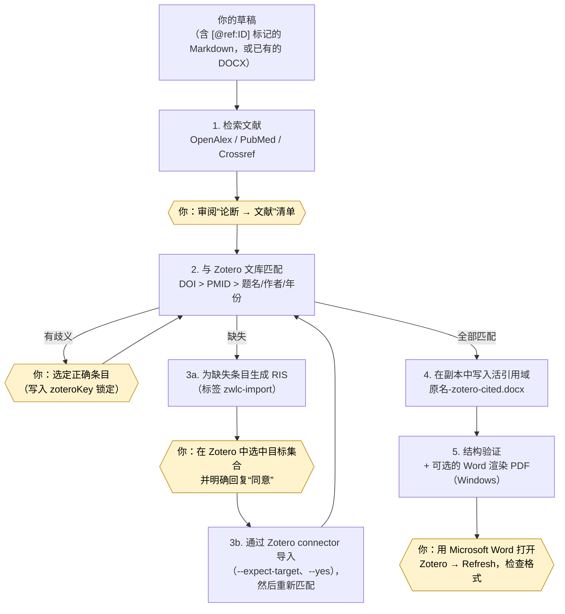

# zotero-word-live-citations

[English](README.md) · **简体中文**

这是一个同时适用于 **Claude Code** 和 **OpenAI Codex** 的 agent 技能（skill），用来把草稿变成带 **Zotero 活引用** 的 Word 文档。它先在 OpenAlex、PubMed、Crossref 中查找能支撑论述的文献，再到你本机的 Zotero 桌面版文库中逐条匹配；文库里没有的条目，要等你明确同意后才会导入。最后，它在 DOCX 的**副本**里写入真正的 `ADDIN ZOTERO_ITEM CSL_CITATION` 和 `ZOTERO_BIBL` 域。生成的文档和你用 Zotero Word 插件手动插入的引用完全一样，可以刷新、切换样式、继续编辑，而不是一串纯文本的 `[1]`。所有脚本只依赖 Python ≥ 3.9 标准库，不会自动安装任何东西。

> [!IMPORTANT]
> **有些步骤只能由你亲自完成。** agent 负责检索、匹配、生成导入文件、写入引用域和结构验证，但它**不会安装任何软件**，**未经你明确回复“同意”绝不会往 Zotero 导入条目**，也**绝不会替你执行 Zotero Refresh（刷新）**。首次使用前，请先阅读[必须手动完成的步骤](#必须手动完成的步骤)。

## 目录

- [工作原理](#工作原理)
- [功能特点](#功能特点)
- [环境要求](#环境要求)
- [必须手动完成的步骤](#必须手动完成的步骤)
- [快速上手](#快速上手)
- [提问示例](#提问示例)
- [最小手动命令示例](#最小手动命令示例)
- [支持的引文格式](#支持的引文格式)
- [安全保证](#安全保证)
- [端到端实测](#端到端实测)
- [仓库结构](#仓库结构)
- [文档索引](#文档索引)
- [常见问题](#常见问题)
- [许可与致谢](#许可与致谢)

## 工作原理



矩形为自动步骤，**黄色六边形为需要你亲自操作的步骤**。

## 功能特点

- **完整链路：** 文献检索 → Zotero 条目（key + URI + CSL `itemData`）→ DOCX 中的 Zotero 域 → 你在 Word 中刷新。
- **真正的 Zotero 域：** 每个引用位置一个 `ADDIN ZOTERO_ITEM CSL_CITATION` 域，外加一个 `ZOTERO_BIBL` 参考文献表域，以及记录样式和语言的 `ZOTERO_PREF_n` 文档偏好。
- **严谨的匹配：** 指定 key > DOI > PMID > 题名精确匹配 > 题名 + 第一作者 + 年份。有歧义的匹配**绝不**自动选择，文库中的重复条目只报告，不合并。
- **导入必须经你批准：** 先生成 RIS/BibTeX 供你查看，再导入到**你亲自选中**的集合。`--expect-target` 防止导错位置，`zwlc-import` 标签方便日后查找和撤销。
- **两种插入方式：** 在正文中写 `[@ref:ID]` / `[@zotero:KEY]` / `[@doi:…]` 标记；如果正文一个字都不能改，就用 `placements.json` 按锚点文字定位（配合 `--list-paragraphs` 和 `--dry-run`）。
- **一处引用可含多篇文献**（`[@ref:A; @ref:B]` 合成一个域）。每条引用都内嵌 `itemData`，合作者即使文库里没有该条目也能正常使用。已有的引用会原样保留并经过校验。
- **可靠的验证：** 检查 ZIP/XML 完整性、域结构是否完整、`citationID` 是否唯一、key 与 URI 是否一致、`itemData` 覆盖率、原有引用是否保留。Windows 上还可以调用 Word 渲染 PDF 查看版面。
- **Markdown → DOCX** 转换，方便 agent 直接起草稿件，支持中文字体。
- **对中文用户友好：** 内置 GB/T 7714-2015 样式别名，支持 `zh-CN` 语言、中文路径，Windows 控制台统一 UTF-8 输出。
- **只用标准库，不自动安装任何东西。** 附 38 个单元测试。

## 环境要求

| 组件 | 版本 | 用途 |
|---|---|---|
| Python | ≥ 3.9 | 全部功能 |
| Zotero 桌面版 | 7 及以上（实测 10.0.2），**需保持运行**，并开启“允许此计算机上的其他应用程序与 Zotero 通讯”（本地 API：`http://127.0.0.1:23119/api/`） | 条目匹配、导入 |
| Microsoft Word + Zotero Word 插件 | Word 2016 / Microsoft 365（实测 Word 16） | 手动 Refresh；PDF 渲染（仅 Windows） |
| Claude Code 或 OpenAI Codex | 当前版本 | 以 agent 技能方式运行 |
| 联网 | | 仅文献检索需要 |

## 必须手动完成的步骤

> [!IMPORTANT]
> **首次使用前（只需一次）**
> 1. **安装 Python ≥ 3.9。** 本技能不会替你安装任何东西。Windows 用户注意微软商店的 `python` 占位程序（提示“Python was not found…”）：请从 python.org 安装，并用 `py -3` 运行。Codex 用户也可以使用 Codex 自带的 Python。
> 2. **启动 Zotero 桌面版并开启本地通讯：** 设置 → 高级 → 杂项 → 勾选“允许此计算机上的其他应用程序与 Zotero 通讯”。可以用 `selftest.py` 或 `zotero_local.py status` 检查。
> 3. **安装 Zotero Word 插件：** Zotero → 设置 → 引用 → 文字处理软件 → 安装 Microsoft Word 加载项，然后**重启 Word**。
> 4. **在 Zotero 中安装需要的引文样式**（设置 → 引用 → 样式），例如 GB/T 7714-2015。
> 5. **文库从未同步过？** 请先用 zotero.org 账号同步一次，因为引用 URI 需要同步后才有的用户 ID（或改用群组文库）。

> [!CAUTION]
> **每次导入前：请你自己在 Zotero 窗口里新建或选中目标集合。** connector 会把条目导入**当前选中**的集合，没有参数可以指定集合。agent 会告诉你“N 条记录 → 集合 X”，并等你明确回复**同意**。如果选中的集合在此期间变了，`--expect-target` 会拒绝导入。建议使用专门的测试集合。导入的条目都带有 `zwlc-import` 标签，方便你自己查找和撤销（本技能从不删除任何东西）。

> [!WARNING]
> **请审阅所选文献。** agent 只能引用检索工具真实返回的论文，也绝不会编造 DOI。但**每篇文献是否真能支撑你的论断，要由你负责判断**。遇到有歧义的匹配，agent 会请你选择，并用 `"zoteroKey"` 锁定你选的条目。

> [!IMPORTANT]
> **生成之后：** 用 **Microsoft Word** 打开 `<原名>-zotero-cited.docx`（不要用 WPS、LibreOffice 或 Pages，它们可能破坏域）→ 点击 **Zotero 选项卡 → Refresh（刷新）** → 检查引文格式、编号和参考文献表。刷新之前看到的文字只是**临时占位**。之后随时可以在 **Zotero → Document Preferences（文档首选项）** 中更换样式。Refresh **永远不会**自动执行。

> [!NOTE]
> 请做好备份，不要让任何操作覆盖原稿；处理多人共享的文档前先和合作者沟通。PDF 渲染（`word_render.py`）仅支持 Windows，macOS/Linux 上跳过即可。可选环境变量：`ZWLC_MAILTO`、`NCBI_API_KEY`、`ZOTERO_LOCAL_BASE_URL`。

**完整清单（含 Zotero / Word 的中英文菜单路径）：[docs/zh-CN/manual-steps.md](docs/zh-CN/manual-steps.md)**

## 快速上手

### 1. 获取代码

```bash
git clone https://github.com/<owner>/zotero-word-live-citations.git
```

```bash
cd zotero-word-live-citations
```

### 2a. Claude Code

用安装脚本（复制到 `~/.claude/skills/zotero-word-live-citations`）：

```bash
python install.py --target claude
```

或者在 Claude Code 中通过插件市场安装：

```text
/plugin marketplace add <owner>/zotero-word-live-citations
```

```text
/plugin install zotero-word-live-citations@zotero-word-live-citations
```

### 2b. OpenAI Codex

复制到 `$CODEX_HOME/skills/`（默认 `~/.codex/skills/`）：

```bash
python install.py --target codex
```

### 2c. 手动复制

把 `skills/zotero-word-live-citations/` 整个文件夹复制到 `~/.claude/skills/` 或 `~/.codex/skills/` 下，确保 `SKILL.md` 直接位于 `zotero-word-live-citations/` 目录中。

安装脚本的其他选项：`--target both`（两个平台都装）、`--project <目录>`（只装到某个项目）、`--dry-run`（只预览）、`--force`（覆盖不同的旧版本）、`--uninstall`（卸载）。Windows 上如果 `python` 不可用，请用 `py -3 install.py …`。详见 [docs/zh-CN/installation.md](docs/zh-CN/installation.md)。

### 3. 检查环境

**新开**一个 agent 会话，确认 Zotero 已启动，然后运行：

```bash
python ~/.claude/skills/zotero-word-live-citations/scripts/selftest.py
```

```text
[OK ] python: 3.12.4 at …
[OK ] zotero-running: Zotero 10.0.2
[OK ] zotero-local-api: local API enabled
[OK ] zotero-read-items: read one item key
[OK ] docx-pipeline: insert + validate OK
[OK ] microsoft-word: C:\Program Files\Microsoft Office\root\Office16\WINWORD.EXE
capabilities: literatureSearch=yes, zoteroSearchResolve=yes, zoteroImport=yes, docxInsertValidate=yes, markdownToDocx=yes, wordRendering=yes
```

## 提问示例

- “用中文写一篇肿瘤免疫治疗的短综述，用 `[@ref:ID]` 标记需要引用的地方，为每个论断查找文献，最后给我一份带 Zotero 活引用、GB/T 7714 顺序编码制的 Word 文档。”
- “为 `draft.md` 中的每个论断查找支撑文献，生成带 Zotero 活引用（Vancouver 格式）的 Word。”
- “把 `refs.ris` 里的文献按标记位置插入 `manuscript.docx`，要 Zotero 引用。”
- “在 `chapter3.docx` 中我列出的这几句话后面插入这些 DOI 的引用，正文一个字都不要改。”
- “检查 `thesis.docx` 里的 Zotero 引用域是否有效。”

在 Codex 中，可以用 `$zotero-word-live-citations` 显式调用本技能。

## 最小手动命令示例

所有脚本都可以脱离 agent 直接使用。`S` 表示技能的 `scripts/` 目录。

```bash
S=skills/zotero-word-live-citations/scripts
```

```bash
python $S/search_literature.py search "PD-1 blockade melanoma" --source openalex,pubmed --limit 5 --out candidates.json
```

```bash
python $S/resolve_references.py --references candidates.json --out map.json
```

如有缺失条目：先生成 RIS，**在 Zotero 中选中目标集合**，再导入并重新匹配：

```bash
python $S/build_import_file.py --map map.json --format ris --out missing.ris --tag zwlc-import
```

```bash
python $S/zotero_local.py selected-target
```

```bash
python $S/zotero_local.py import-ris --file missing.ris --expect-target "我的测试集合" --yes
```

```bash
python $S/resolve_references.py --references candidates.json --out map.json
```

`draft.md` 中写有 `[@ref:C1; @ref:C3]` 这样的标记：

```bash
python $S/md_to_docx.py --input draft.md --output draft.docx
```

```bash
python $S/insert_zotero_fields.py --input draft.docx --items map.json --placeholders --style gb-t-7714-numeric --locale zh-CN --bibliography-heading "参考文献" --report report.json
```

```bash
python $S/validate_zotero_docx.py draft-zotero-cited.docx --baseline draft.docx --require-item-data --expect-bibliography --json
```

最后用 Word 打开 `draft-zotero-cited.docx`，点击 **Zotero → Refresh**。在 PowerShell 中，变量写作 `$S = "skills\zotero-word-live-citations\scripts"`，命令写作 `python "$S\search_literature.py" …`。完整说明见 [docs/zh-CN/usage.md](docs/zh-CN/usage.md)。

## 支持的引文格式

| `--style` 别名 | CSL 样式 |
|---|---|
| `vancouver`（默认） | `http://www.zotero.org/styles/vancouver` |
| `apa` | `http://www.zotero.org/styles/apa` |
| `nature` | `http://www.zotero.org/styles/nature` |
| `ieee` | `http://www.zotero.org/styles/ieee` |
| `ama` | `http://www.zotero.org/styles/american-medical-association` |
| `chicago-author-date` | `http://www.zotero.org/styles/chicago-author-date` |
| `harvard` | `http://www.zotero.org/styles/harvard-cite-them-right` |
| `gb-t-7714-numeric` | `http://www.zotero.org/styles/china-national-standard-gb-t-7714-2015-numeric` |
| `gb-t-7714-author-date` | `http://www.zotero.org/styles/china-national-standard-gb-t-7714-2015-author-date` |

**其他任何 CSL 样式也都可以用**，直接传入完整 ID 即可（例如 `--style http://www.zotero.org/styles/cell`）。要让 Refresh 应用该样式，它必须已安装在你的 Zotero 中。`--locale` 设置引文语言（默认 `en-US`，中文用 `zh-CN`）。之后也可以在 Word 中通过 **Zotero → Document Preferences（文档首选项）** 随时更换样式。

## 安全保证

- **绝不覆盖原稿。** 输出文件为 `<原名>-zotero-cited.docx`，报告中列出输入、输出两个文件的 SHA-256，以及 `inputUnchanged`（输入是否未变）。
- **未经你明确批准，绝不写入 Zotero。** 批准必须针对具体的条数和目标。唯一支持的写操作是导入，不会编辑、移动、合并或删除条目，也不会改动 Zotero 设置。
- **不编造文献：** 只引用检索或查询工具真实返回的论文。凭记忆给出的 DOI 必须先通过 `lookup` 核实。
- **不猜测：** 有歧义的匹配交给你决定。导入失败会如实报告，绝不用猜测的 key 或 URI 蒙混过关。
- **条目身份准确：** 只引用父条目（不引用附件或笔记）。URI 取自条目所在的文库，不会混用不同文库的命名空间。
- **不伪造格式化结果：** 从不自行生成 `formattedCitation`/`plainCitation`，这两项由 Zotero 在 Refresh 时生成。
- **改动最小：** 只修改 `word/document.xml`、`docProps/custom.xml`、`[Content_Types].xml`、`_rels/.rels`，其余部分逐字节复制。原有引用必须通过保留性校验。
- **如实报告：** “结构验证”“Word 渲染”“Zotero Refresh”三项结果分开列出。
- **仅限本机：** 只通过 `127.0.0.1` 访问 Zotero，只有文献检索需要联网。不需要任何凭据，没有遥测。详见 [SECURITY.md](SECURITY.md)。

## 端到端实测

测试环境为 **Windows 11 + Zotero 10.0.2 + Word 16（Microsoft 365）+ Zotero Word 插件**。一篇约 1,575 字的肿瘤免疫学中文综述，含 18 个 `[@ref:ID]` 标记 → 共 15 次文献检索 → 选定 18 篇论文（如 Dunn 2004《The Three Es of Cancer Immunoediting》、Hodi 2010 伊匹木单抗 NEJM、Rizvi 2015 Science、Maude 2014 CAR-T NEJM）→ 18 篇在文库中均不存在 → 生成 RIS。用户在 Zotero 中选中专用集合“肿瘤免疫测试”并同意后导入 → 重新匹配，18/18 全部按 DOI 命中 → 写入 17 个引用域（其中一个域同时引用两篇，显示为 `[11,12]`）+ 参考文献表 + GB/T 7714-2015 顺序编码制（zh-CN）文档偏好 → 结构验证通过 → Word 渲染共 4 页 → **用户在 Word 中执行 Zotero Refresh，成功**。完整步骤见 [docs/zh-CN/usage.md § 16](docs/zh-CN/usage.md#worked-example)。

## 仓库结构

```text
zotero-word-live-citations/
├── .claude-plugin/
│   ├── plugin.json              # Claude Code 插件清单
│   └── marketplace.json         # Claude Code 插件市场（即本仓库）
├── .codex-plugin/
│   └── plugin.json              # Codex 插件清单
├── skills/zotero-word-live-citations/
│   ├── SKILL.md                 # 面向 agent 的工作流程（技能本体）
│   ├── agents/openai.yaml       # Codex 界面元数据
│   ├── references/              # 流程、检索、本地 API、域格式、引用定位、导入策略、故障排查
│   ├── scripts/
│   │   ├── _common.py              # 公共的 HTTP / Zotero / 规范化工具
│   │   ├── selftest.py             # 环境自检
│   │   ├── search_literature.py    # OpenAlex / PubMed / Crossref 检索与查询
│   │   ├── resolve_references.py   # 把参考文献匹配到 Zotero 条目
│   │   ├── build_import_file.py    # 为缺失条目生成 RIS/BibTeX
│   │   ├── zotero_local.py         # 本地 API 只读访问 + 经批准的 connector 导入
│   │   ├── md_to_docx.py           # Markdown → DOCX
│   │   ├── insert_zotero_fields.py # 在副本中写入活引用域
│   │   ├── validate_zotero_docx.py # 结构验证
│   │   └── word_render.py          # Word COM 渲染 PDF（Windows）
│   └── tests/                   # 单元测试和测试数据
├── docs/
│   ├── en/                      # 英文文档：安装、使用、手动步骤、故障排查、FAQ、发布
│   └── zh-CN/                   # 中文文档（同上）
├── install.py                   # Claude Code / Codex 安装脚本
├── README.md · README.zh-CN.md
├── CHANGELOG.md · CONTRIBUTING.md · SECURITY.md
└── LICENSE · NOTICE
```

## 文档索引

| 主题 | 中文 | English |
|---|---|---|
| 安装 | [docs/zh-CN/installation.md](docs/zh-CN/installation.md) | [docs/en/installation.md](docs/en/installation.md) |
| 使用（全部脚本、参数、输出、完整实例） | [docs/zh-CN/usage.md](docs/zh-CN/usage.md) | [docs/en/usage.md](docs/en/usage.md) |
| **手动步骤清单** | [docs/zh-CN/manual-steps.md](docs/zh-CN/manual-steps.md) | [docs/en/manual-steps.md](docs/en/manual-steps.md) |
| 故障排查 | [docs/zh-CN/troubleshooting.md](docs/zh-CN/troubleshooting.md) | [docs/en/troubleshooting.md](docs/en/troubleshooting.md) |
| 常见问题 | [docs/zh-CN/faq.md](docs/zh-CN/faq.md) | [docs/en/faq.md](docs/en/faq.md) |
| 发布指南（维护者） | [docs/zh-CN/publishing.md](docs/zh-CN/publishing.md) | [docs/en/publishing.md](docs/en/publishing.md) |
| agent 工作流程 | [SKILL.md](skills/zotero-word-live-citations/SKILL.md) 与 [references/](skills/zotero-word-live-citations/references/)（英文） | |
| 更新日志 · 贡献 · 安全 | [CHANGELOG.md](CHANGELOG.md) · [CONTRIBUTING.md](CONTRIBUTING.md) · [SECURITY.md](SECURITY.md)（中英双语） | |

## 常见问题

**原稿会被修改吗？** 不会。所有改动都写在副本里，并会核对原稿的哈希值。

**会删除或修改我的 Zotero 条目吗？** 不会。它只做导入，而且必须经过你明确同意。想撤销导入，可以通过 `zwlc-import` 标签找到这些条目后自己删除。

**为什么刷新前引用看起来很简陋？** 刷新前显示的是有意设计的临时文字，Zotero 刷新时会按样式重新排版。

**agent 能替我点 Refresh 吗？** 不能。这一步永远由你在 Word 中完成。

**macOS / Linux 能用吗？** 除了可选的 Word PDF 渲染，其他功能都能用。Refresh 需要装有 Zotero 插件的 Microsoft Word。

**支持群组文库吗？** 支持，使用 `--library group:<id>`。从未同步过的本地文库需要先同步一次。

更多问题见 [docs/zh-CN/faq.md](docs/zh-CN/faq.md)。

## 许可与致谢

本项目采用 [MIT 许可](LICENSE)。部分代码改编自 [drguptavivek/zotero-use](https://github.com/drguptavivek/zotero-use)（DOCX 验证器、域安全规则）和 [openai/plugins](https://github.com/openai/plugins) 中的 Zotero 插件（本地 API / connector 工具函数），二者均为 MIT 许可。各自改编了哪些部分，见 [NOTICE](NOTICE)。

Zotero 是 Corporation for Digital Scholarship 的商标。本项目与 Zotero、Microsoft、Anthropic、OpenAI 均无隶属或背书关系。
